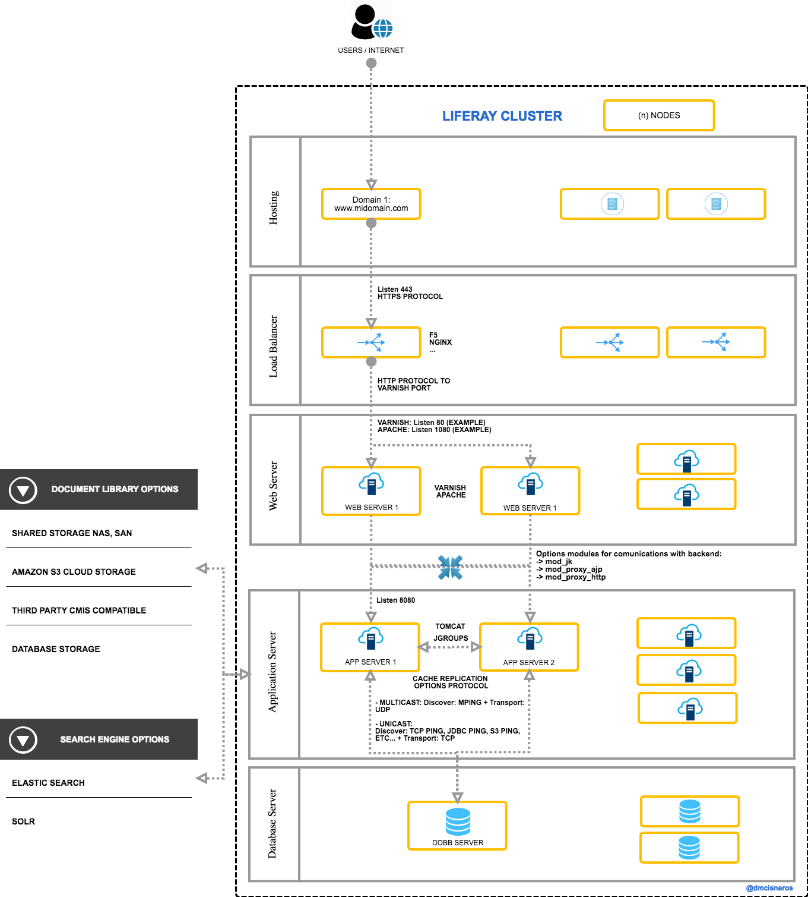

Apuntes sobre conceptos básicos de un cluster de liferay. 

<a href="cluster.MD">cluster</a>
: Resumen sobre los elementos que utilizamos en nuestras configuraciones de cluster.

<a href="liferay-performance-tunning.MD"> liferay-performance-tunning</a>
: Tunning a realizar en un cluster.

