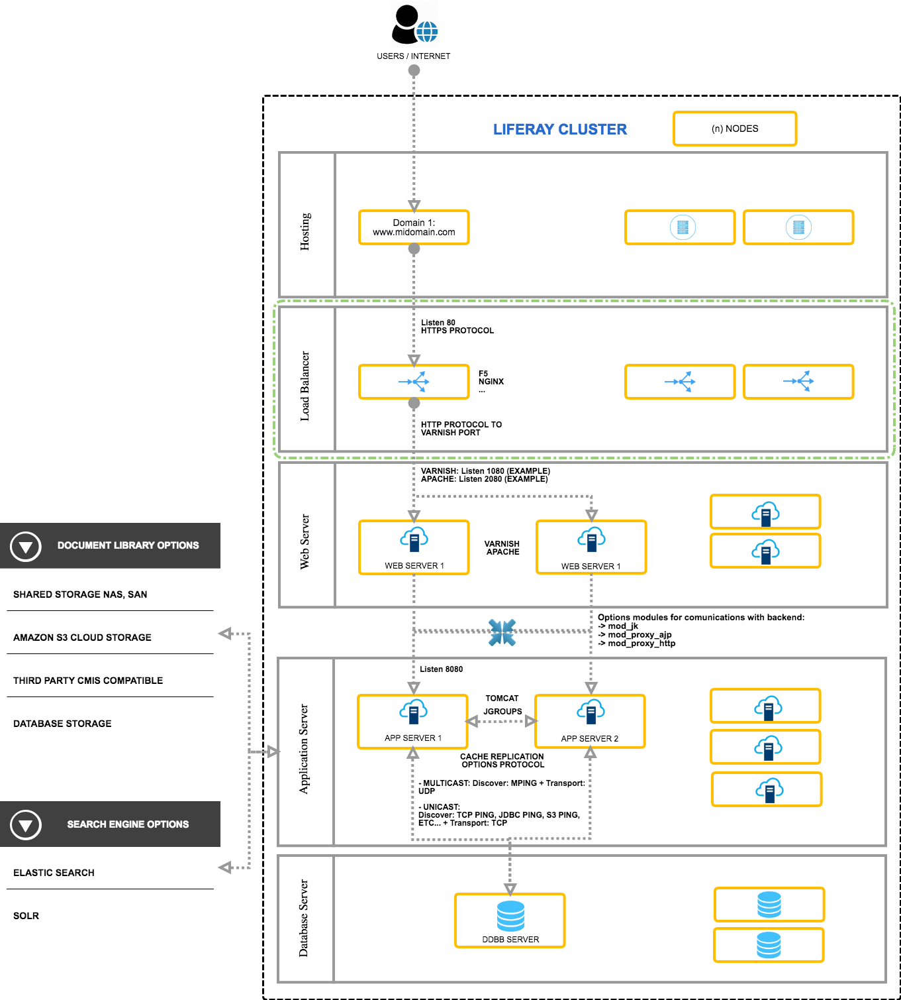

<html class="no-js" xmlns="http://www.w3.org/1999/xhtml" xml:lang="en-US" lang="en-US" dir="ltr" prefix="og: http://ogp.me/ns#"><head>
<body>

<h3 style="margin-left: 40px;">&nbsp;</h3>

<h1 style="margin-left: 40px;">Liferay Clustering conceptos básicos</h1>

<h2 style="margin-left: 40px;"><strong>Introducción</strong></h2>

Añado este documento a modo de manual para uso propio con recursos web que me han ayudado a comprender los elementos que componen un cluster en Liferay. La configuración del cluster se centrará en el servidor web y el servidor de aplicaciones, indicando un resumen muy genérico de los demás componentes.

Antes de comenzar a desglosar los distintos elementos que suelen componer voy a hacer uso de una imágen que los muestra de forma clara:

<h2 style="margin-left: 40px;"><strong>Definiciónes</strong></h2>

Los elementos utilizados para éste tutorial han sido los siguientes:

<ul>
	<li style="margin-left: 40px;">F5: Balanceador de carga</li>
	<li style="margin-left: 40px;">Apache web server: Servidor web</li>
	<li style="margin-left: 40px;">Tomcat: Servidor de aplicaciones&nbsp;</li>
	<li style="margin-left: 40px;">Mysql: Base de datos</li>
	<li style="margin-left: 40px;">ElasticSearch: Motor de índices</li>
</ul>

<h2 style="margin-left: 40px;"><strong>1. Balanceador:</strong></h2>

Se puede hacer uso de un elemento que realice ésta función a nivel de software como puede ser con Apache, NGINX, etc...&nbsp;o a nivel de Hardware por ejemplo con un&nbsp;F5.

Serán los responsables de aplicar diferentes algorítmos para realizar la distribución de carga entre los servidores web del nivel inferior del cluster&nbsp;aplicando entre otras técnicas como Round Robin, Least connections, Least response time, etc...

<h2 style="margin-left: 40px;">2. Servidor Web:</h2>

Encargado de procesar las peticiones vía http y&nbsp;enviar la petición a un servidor de aplicaciones para posteriormente&nbsp;devolver contenido estático al cliente.

Nos centraremos en la configuración de la comunicación con el backend del servidor web apache, adicionalmente para optimizar la caché de nuestro cluster podríamos añadir un varnish que actue previamente añadiendo un nuevo nivel de caché. 
</ p>

Tenemos distintas opciones de configuración con sus pros y sus contras, se recomienda hacer un análisis previo para el uso de uno u otro.

<ul>
	<li style="margin-left: 40px;"><strong>Uso de mod_jk</strong></li>
	<li style="margin-left: 40px;"><strong>Uso de mod_proxy_ajp</strong></li>
	<li style="margin-left: 40px;"><strong>Uso de mod_proxy_http</strong></li>
</ul>

<h3 style="margin-left: 40px;">2.1 Usando mod_jk:</h3>

Ésta opción nos permite configurar la carga del balanceador en el servidor web usando el módulo mod_jk de apache, internamente el módulo mod_jk conecta con el servidor de aplicaciones Tomcat de liferay utilizando el protocolo AJP.

Utilizando ésta opción todas las peticiones entre el apache y el tomcat irán por éste protocolo, pudiendo desactivar los conectores que no utilicemos.

Pasemos a su configuración:

<strong>2.1.1 Descargar el mod_jk y añadirlo al directorio:</strong>

$APACHE_HOME/modules

<strong>2.1.2&nbsp;Crear un fichero en el directorio:</strong>

$APACHE_HOME/conf, con el siguiente contenido: <code> </code>

<code>LoadModule </code>

<code>jk_module modules/mod_jk.so</code>

<code>JkWorkersFile /etc/httpd/conf/workers.properties</code>

<code>JkShmFile /var/log/httpd/mod_jk.shm</code>

<code>JkLogFile /var/log/httpd/mod_jk.log</code>

<code>JkLogLevel info JkLogStampFormat "[% a %b %d %H:% M:% S %Y] "</code>

<code>JkMount /* liferay_balancer</code>

<strong>2.1.3 Editar el fichero httpd.conf añadiendo el nuevo módulo:</strong>

include mod_jk.conf

<strong>2.1.4 Añadir el fichero de configuración del worker para AJP, worker.properties: </strong>

<code>Name of the load balancer workers 
<strong>worker.list = liferay_balancer</strong> 
#Worker configuration for liferay-node-01 
#AJP Connector port of node-01 on liferay-node-01 server 
<strong>worker.node-01.port = 8009 
worker.node-01.host = &lt; IP of liferay-node-01 server &gt; 
worker.node-01.type = ajp13</strong> 
#Factor which decides the load sharing by this worker in the cluster 
worker.node-01. lbfactor = 1 
#Worker configuration for liferay-node-02 
<strong>worker.node-02.port = 8009 
worker.node-02.host = &lt; IP of liferay-node-02 server &gt; 
worker.node-02.type = ajp13</strong> 
worker.node-02.lbfactor = 1 
#load balancer configuration properties 
worker.loadbalancer.type = lb 
#list of worker nodes that are part of the cluster 
w<strong>orker.loadbalancer.balance_workers = node-01, node-02</strong> 
worker.loadbalancer.sticky_session = 1 
worker.loadbalancer.method = B //Hay varias opciones para el balanceo, B sería dependiendo de la carga del tomcat, ByRequests dependiendo de la carga por número de peticiones, ByTraffic dependiendo de la carga del tráfico en bytes.</code>

<h3 style="margin-left: 40px;">2.2 Usando mod_proxy_ajp:</h3>

Ésta opción nos permite configurar la carga del balanceador en el servidor web usando el módulo mod_proxy_ajp y el mod_proxy_balancer de apache, internamente utiliza el módulo mod_proxy y conecta con el servidor de aplicaciones Tomcat de liferay utilizando el protocolo AJP al igual que el mod_jk.

Utilizando ésta opción toda las peticiones entre el apache y el tomcat irán por éste protocolo, pudiendo desactivar los conectores que no utilicemos. Pasemos a su configuración:

<strong>2.2.1&nbsp;Crear un nuevo fichero mod_proxy_ajp.conf&nbsp;</strong>en $APACHE_HOME/conf con el siguiente contenido:

<code>LoadModuleproxy_modulemodules/mod_proxy.so</code>

<code>LoadModule proxy_ajp_module modules/mod_proxy_ajp.so</code>

<code>LoadModule proxy_balancer_module /modules/mod_proxy_balancer.so</code>

&nbsp;

Y también añadiremos el virtualhost correspondiente en el mismo fichero:&nbsp;

<code>&lt; VirtualHost *: 80 &gt; 
ServerName localhost.localdomain 
ErrorLog /var/ log/ apache2/ ajp.error.log 
CustomLog /var/ log/ apache2/ ajp.log combined 
&lt; Proxy *&gt; 
AddDefaultCharSet Off 
Order deny, allow 
Allow from all 
<strong>&lt;/ Proxy &gt; 
ProxyPass / balancer:// ajpCluster/ stickysession = JSESSIONID 
ProxyPassReverse / balancer:// ajpCluster/ stickysession = JSESSIONID 
&lt; Proxy balancer:// ajpCluster &gt; 
BalancerMember ajp:// &lt; IP of liferay-node-01 &gt;: 8009 route = node-01 
BalancerMember ajp:// &lt; IP of liferay-node-02 &gt;: 8009 route = node-02 
ProxySet lbmethod = byrequests 
&lt;/ Proxy &gt;</strong> 
&lt;/ VirtualHost &gt;</code>

<b>2.2.2 Editar el fichero httpd.conf añadiendo el nuevo módulo:</b>

include mod_proxy_ajp.conf

<h3 style="margin-left: 40px;">2.3 Usando mod_proxy_http:</h3>

Ésta opción nos permite configurar la carga del balanceador en el servidor web usando el módulo mod_proxy_http, en el caso de tener que realizar la comunicación entre el apache y el tomcat por http o https necesitaremos configurar el balanceador con éste módulo. Pasemos a su configuración:

<strong>2.3.1 Crear un nuevo fichero mod_proxy_ajp.conf </strong>en $APACHE_HOME/conf con el siguiente contenido:

<code>LoadModule proxy_modulemodules/mod_proxy.so</code>

<code>LoadModule proxy_http_module modules/mod_proxy_http.so</code>

<code>LoadModule proxy_balancer_module /modules/mod_proxy_balancer.so</code>

&nbsp;

Y también añadiremos el virtualhost correspondiente en el mismo fichero:

<code>&lt; VirtualHost *: 80 &gt; 
ServerName localhost.localdomain 
ErrorLog /var/ log/ apache2/ http.error.log 
CustomLog /var/ log/ apache2/ http.log combined 
&lt; Proxy *&gt; 
AddDefaultCharSet Off 
Order deny, allow 
Allow from all 
&lt;/ Proxy &gt; 
ProxyPass / balancer:// httpCluster/ stickysession = JSESSIONID 
ProxyPassReverse / balancer:// httpCluster/ stickysession = JSESSIONID 
&lt; Proxy balancer:// httpCluster &gt; 
BalancerMember http:// &lt; IP of liferay-node-01 &gt;: 8080 route = node-01 
BalancerMember http:// &lt; IP of liferay-node-02 &gt;: 8080 route = node-02 
ProxySet lbmethod = byrequests 
&lt;/ Proxy &gt; 
&lt;/ VirtualHost &gt;</code>

<strong>2.3.2 Editar el fichero httpd.conf añadiendo el nuevo módulo:</strong>

<code>include mod_proxy_ajp.conf</code>

<strong>2.4&nbsp;Editar el fichero server.xml de los tomcats</strong>:

En todas las opciones es necesario añadir el nombre de jvmRoute definido en cada nodo de&nbsp; del cluster

<code>Ubicación: $TOMCAT_HOME\conf 
Contenido nodo 1: 
&lt; Engine defaultHost ="localhost" name ="Catalina" jvmRoute ="node-01" &gt; 
Contenido nodo 2: 
&lt; Engine defaultHost ="localhost" name ="Catalina" jvmRoute ="node-02" &gt;</code>

&nbsp;

Una vez realizada la configuración del cluster de apache podríamos probar la configuración atacando al apache y verificando que resuelve el portal de liferay, posteriormente configuraremos otros elementos del cluster.

<h2 style="margin-left: 40px;">&nbsp;</h2>

<h2 style="margin-left: 40px;">3. Servidor de aplicaciones (Liferay):</h2>

En este punto realizaremos la configuración del cluster a nivel de los servidores de aplicaciones donde está instalado Liferay,

Tenemos que tener en consideración los siguientes elementos:

<strong>3.1 Configuración de base de datos:</strong> Todos los nodos del cluster deben apuntar a la misma base de datos o al balanceador del cluster de la base de datos utilizada. Lo más recomendable es hacer uso de un datasource utilizando JNDI, añadiendo en el portal-ext.properties su nombre:

<code>jdbc.default.jndi.name=jdbc/LiferayPool</code>

<strong>3.2 Filesystem compartido (Data folder): </strong>El repositorio de la biblioteca de documentos y librería multimedia por defecto tiene una configuración de FileSystemStore, siendo la recomendable el cambio a AdvancedFileSystemStore. Hay otras existentes que pueden ser utilizadas como DBStore, JCRStore, S3Store, CMISStore.

Para modificarla simplemente es necesario configurarla en el portal-ext.properties dependiendo de la que queramos utilizar:

<code>dl.store.impl=com.liferay.portal.store.file.system.FileSystemStore </code>

## Recommended property for Production, Shared storage NAS file system (e.g. NFS, SMB, AFS, etc.) SAN file system (e.g. Fiber Channel, iSCSI, etc.)

<code>dl.store.impl=com.liferay.portal.store.file.system.AdvancedFileSystemStore</code>

En el caso de elegir la opción de AdvancedFileSystemStore es necesario añadir la configuración en el directorio [Liferay Home]/osgi/configs en un fichero con el nombre:

<code>com.liferay.portal.store.file.system.configuration.FileSystemStoreConfiguration.cfg </code>

que indique la ubicación del directorio compartido del filesystem: <code>rootDir=opt/dxp/data/document_library</code>

<code></code>

<strong>3.3 Configuración de replicación de caché:</strong> En un cluster cada nodo tendrá su propia copia de caché, es muy importante invalidar o replicar la caché entre los distintos nodos de un cluster.

Liferay hace uso de <strong>Ehcache</strong> para cachear recursos y consultas a la capa de persistencia, haciendo uso de memoria y ficheros del sistema. Para realizar la replicación o actualización de cachés Liferay utiliza cluster link para generar y replicar la caché entre los nodos del cluster, internamente utiliza <strong>JGroups</strong>.

Para utilizarlo es necesario activar en todos los nodos del cluster la siguientes propiedades&nbsp;del portal-ext.properties

<code>cluster.link.enabled=true </code>

<code>cluster.link.autodetect.address=DB.Server.IP:Port </code>

<code>ehcache.cluster.link.replication.enabled=true</code>

Para hacer uso de la replicación de caché, se pueden seguir las siguientes estrategias:

<strong>3.3.1.a Caché distribuida (Multicast): </strong>

Para utilizarlo se puede configurar con el protocolo TCP o UDP. Por defecto el uso de multicast utiliza <strong>MPING</strong> para descubrir los nodos del cluster y <strong>UDP </strong>/ IP MUlticast para el transporte. Si se puede hace uso de UDP no sería necesaria ninguna configuración adicional a la descrita a continuación en el portal-ext.properties:

<code>## Multicast</code>

<code># Each address and port combination represent a conversation that is made</code>

<code># between different nodes. If they are not unique or correctly set, there</code>

<code># will be a potential of unnecessary network traffic that may cause slower</code>

<code># updates or inaccurate updates.</code>

<code>multicast.group.address["cluster-link-control"]=239.255.0.1</code>

<code>multicast.group.port["cluster-link-control"]=23301</code>

<code>multicast.group.address["cluster-link-udp"]=239.255.0.2</code>

<code>multicast.group.port["cluster-link-udp"]=23302</code>

<code>multicast.group.address["cluster-link-mping"]=239.255.0.3</code>

<code>multicast.group.port["cluster-link-mping"]=23303</code>

<code>multicast.group.address["multi-vm"]=239.255.0.5</code>

<code>multicast.group.port["multi-vm"]=23305</code>

<strong>3.3.1.b TCP Transport (Unicast):</strong>

Ésta configuración utiliza <strong>TCP_PING</strong> para el descubrimiento de los nodos del cluster y <strong>TCP</strong> para el transporte. Al hacer uso de TCP_PING es necesario conocer con antelación las ips de los nodos del cluster. La configuración a realizar es la siguiente:

<ul>
	<li style="margin-left: 40px;"><strong>setenv.sh:</strong> Añadir todas las ips de los nodos del cluster:</li>
</ul>

<code>-Djgroups.bind_addr= -Djgroups.tcpping.initial_hosts=[port1],[port2]...</code>

<ul>
	<li style="margin-left: 40px;"><strong>tcp-xml:</strong> Es necesario extraerlo del jar de liferay:</li>
</ul>

<code>$liferay_home/osgi/marketplace/Liferay</code>

<code>Foundation.lpkg/com.liferay.portal.cluster.multiple-[version number].jar</code>

Añadir en el tag TCP del fichero singleton_name=”liferay_tcp_cluster” y ubicarlo en la ruta: WEB-INF/classes.

Por último es necesario indicar la ruta en el portal-ext.properties: <code>cluster.link.channel.properties.control=[CONFIG_FILE_PATH]/tcp.xml cluster.link.channel.properties.transport.0=[CONFIG_FILE_PATH]/tcp.xml</code>

Existen más técnicas para el descubrimiento de los nodos del cluster como pueden ser:

<ul>
	<li style="margin-left: 40px;">JDBC_PING (jdbc_ping_config.xml)</li>
	<li style="margin-left: 40px;">S3_PING (s3_ping_config.xml Amazon only),</li>
	<li style="margin-left: 40px;">RACKSPACE_PING (Rackspace only)</li>
</ul>

<strong>3.2 Modificación del tunning de la caché:</strong> Hay ficheros que será necesario modificar y desplegar si se quiere realizar un tunning correcto de la caché a nivel de hibernate, singlevm o múltiple cachés. Se puede realizar dicha modificación con módulos de liferay o&nbsp;en el portal-ext.properties la ubicación de dichos recursos.

<code>ehcache.single.vm.config.location=/custom-ehcache/liferay-single-vm.xml</code>

<code>ehcache.multi.vm.config.location=/custom-ehcache/liferay-multi-vm-clustered.xml</code>

<code>net.sf.ehcache.configurationResourceName=/custom-ehcache/hibernate-clustered.xml</code>

<strong>3.3 Replicación de indices:</strong> En la versión dxp las posibilidades existentes son solr y elasticsearch. Habíandose deprecado el uso de los indices a nivel de ficheros en el sistema. La recomendada por Liferay es Elasticsearch.

<strong>3.3.1 Conectar Elasticsearch y liferay:</strong> Se puede realizar desde:

<ul>
	<li style="margin-left: 40px;">Opción A:&nbsp;&nbsp;El panel de control Control Panel -&gt; System settings -&gt; Foundations -&gt; Search for Elasticsearch</li>
	<li style="margin-left: 40px;">Opción B: Añadiendo el fichero:</li>
</ul>

<code>com.liferay.portal.search.elasticsearch.configuration.ElasticsearchConfiguration.cfg </code>

en el directorio de configuraciones de osgi LIFERAY_HOME/osgi/configs con el siguiente contenido:

<code>&lt;Cluster className="org.apache.catalina.ha.tcp.SimpleTcpCluster" channelSendOptions="8"&gt; 
&lt;Manager className="org.apache.catalina.ha.session.DeltaManager"&nbsp; 
expireSessionsOnShutdown="false" 
notifyListenersOnReplication="true"&gt;&lt;/Manager&gt; 
&lt;Channel className="org.apache.catalina.tribes.group.GroupChannel"&gt;&nbsp; 
&lt;Membership className="org.apache.catalina.tribes.membership.McastService"&nbsp; 
address="224.0.0.5"&nbsp; 
port="45564" frequency="500"&nbsp; 
dropTime="3000"&gt;&lt;/Membership&gt; 
&lt;Sender className="org.apache.catalina.tribes.transport.ReplicationTransmitter"&gt; 
&lt;Transport className="org.apache.catalina.tribes.transport.nio.PooledParallelSender"&gt;&lt;/Transport&gt; 
&lt;/Sender&gt;&nbsp; 
&lt;Receiver className="org.apache.catalina.tribes.transport.nio.NioReceiver"&nbsp; 
address="auto" port="4000" autoBind="100" 
selectorTimeout="5000" maxThreads="6"&gt;&lt;/Receiver&gt; 
&lt;Interceptor className="org.apache.catalina.tribes.group.interceptors.TcpFailureDetector"&gt;&lt;/Interceptor&gt; 
&lt;Interceptor className="org.apache.catalina.tribes.group.interceptors.MessageDispatch15Interceptor"&gt;&lt;/Interceptor&gt; 
&lt;/Channel&gt; 
&lt;Valve className="org.apache.catalina.ha.tcp.ReplicationValve" filter=""&gt;&lt;/Valve&gt; 
&lt;Valve className="org.apache.catalina.ha.session.JvmRouteBinderValve"&gt;&lt;/Valve&gt; 
&lt;ClusterListener className="org.apache.catalina.ha.session.JvmRouteSessionIDBinderListener"&gt;&lt;/ClusterListener&gt; 
&lt;ClusterListener className="org.apache.catalina.ha.session.ClusterSessionListener"&gt;&lt;/ClusterListener&gt; 
&lt;/Cluster&gt;</code>

<strong>3.4 Configuración del servidor de aplicaciones:</strong> Las modificaciones a nivel del servidor de aplicaciones, en éste caso tomcat son las siguientes:

<strong>3.4.1 Configuración del clustering de tomcat.</strong>&nbsp;

En el fichero <strong>server.xml </strong>es necesario añadir la siguiente configuración: En el que cabe destacar los atributos:

<ul>
	<li style="margin-left: 40px;"><strong>jvmRoute="Node1"</strong> en la etiqueta&nbsp;&lt;Engine ..&gt; que es necesario dar el nombre de cada nodo</li>
	<li style="margin-left: 40px;">Configurar el<strong> máximo número de hilos maxThreads="150"</strong> en la etiqueta&nbsp;&lt;Connector ..&gt;</li>
</ul>

<strong>server.xml:</strong>

<code>&lt;Cluster className="org.apache.catalina.ha.tcp.SimpleTcpCluster" channelSendOptions="8"&gt; 
&lt;Manager className="org.apache.catalina.ha.session.DeltaManager"&nbsp; 
expireSessionsOnShutdown="false" 
notifyListenersOnReplication="true"&gt;&lt;/Manager&gt; 
&lt;Channel className="org.apache.catalina.tribes.group.GroupChannel"&gt;&nbsp; 
&lt;Membership className="org.apache.catalina.tribes.membership.McastService"&nbsp; 
address="224.0.0.5"&nbsp; 
port="45564" frequency="500"&nbsp; 
dropTime="3000"&gt;&lt;/Membership&gt; 
&lt;Sender className="org.apache.catalina.tribes.transport.ReplicationTransmitter"&gt; 
&lt;Transport className="org.apache.catalina.tribes.transport.nio.PooledParallelSender"&gt;&lt;/Transport&gt; 
&lt;/Sender&gt;&nbsp; 
&lt;Receiver className="org.apache.catalina.tribes.transport.nio.NioReceiver"&nbsp; 
address="auto" port="4000" autoBind="100" 
selectorTimeout="5000" maxThreads="6"&gt;&lt;/Receiver&gt; 
&lt;Interceptor className="org.apache.catalina.tribes.group.interceptors.TcpFailureDetector"&gt;&lt;/Interceptor&gt; 
&lt;Interceptor className="org.apache.catalina.tribes.group.interceptors.MessageDispatch15Interceptor"&gt;&lt;/Interceptor&gt; 
&lt;/Channel&gt; 
&lt;Valve className="org.apache.catalina.ha.tcp.ReplicationValve" filter=""&gt;&lt;/Valve&gt; 
&lt;Valve className="org.apache.catalina.ha.session.JvmRouteBinderValve"&gt;&lt;/Valve&gt; 
&lt;ClusterListener className="org.apache.catalina.ha.session.JvmRouteSessionIDBinderListener"&gt;&lt;/ClusterListener&gt; 
&lt;ClusterListener className="org.apache.catalina.ha.session.ClusterSessionListener"&gt;&lt;/ClusterListener&gt; 
&lt;/Cluster&gt;</code>

<strong>Resumen:&nbsp;</strong>

Con las configuraciones descritas tendríamos un cluster de liferay como base al que tendríamos que ajustar ciertos valores y realizar un tunning adecuado, dicho tunning se ha descrito de forma detallada en&nbsp;éste enlace:

<a href="liferay-performance-tunning.MD">liferay-performance-tunning/a>

(*) A modo de comentario entre el balanceador y el servidor web se podría hacer uso de otro elemento de caché como podría ser un varnish que tenga como backend el apache.

Referencias

<ul>
	<li>
	
https://dev.liferay.com/es/discover/deployment/-/knowledge_base/7-0/liferay-clustering

	</li>
	<li>
	
http://www.appuntivari.net/informatica/programmazione/liferay/performance-best-practices/load-balancing-and-clustering-best-practices

	</li>
	<li>
	
https://www.knowarth.com/liferay-dxp-clustering/

	</li>
	<li>
	
https://www.xtivia.com/liferay-clustering-with-tcp-unicast/

	</li>
	<li>
	
http://www.javasavvy.com/liferay-cluster-with-cluster-link/&nbsp;&nbsp;

	</li>
</ul>

</body>
</html>
